<div align="center">

# LiteBox

**给 GL.iNet GL-MT3600BE（Beryl 7）等小内存 OpenWrt 路由器用的轻量透明代理，附手机版**

家里所有设备不用任何设置就能分流：国内直连、AI 单独选节点、其余走代理。常驻内存约 50MB。

[](https://github.com/lyr05142002-dot/Q7Y/releases/latest)
[](https://github.com/lyr05142002-dot/Q7Y/actions/workflows/test.yml)

[下载](#下载) · [图文安装教程](#图文安装教程) · [手机版](#手机版) · [常用命令](#常用命令) · [出问题怎么办](#第-5-步检查是否正常工作)

</div>

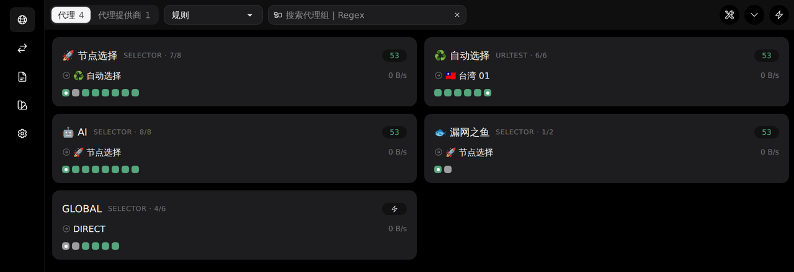

<p align="center"><sub>路由器网页面板（zashboard）。截图来自云端测试环境，节点是演示数据</sub></p>

## 特点

- **GL 官方固件直接装**：GL 固件是 OpenWrt 21.02，[Open-Box](https://github.com/liandu2024/Open-Box) 要求 OpenWrt 24 以上装不了；LiteBox 专门按 21.02 写，不用刷机
- **省内存**：只有一个 mihomo 进程，常驻约 50MB，大流量下也不涨；超过上限自动重启
- **分流规则现成的**：用[视频作者](https://youtu.be/G_7AmjfSRQ8)的[域名集](https://github.com/liandu2024/clash/tree/main/list)，每天自动更新；ChatGPT / Claude / Gemini / Grok 等走单独的 🤖 AI 分组
- **手机版**：安卓、iPhone 用同一套规则，出门在外也一样分流
- **出问题能自救**：`litebox doctor` 一键自检、`litebox direct` 一键恢复直连；内核起不来时看门狗自动恢复 DNS，不会全家断网
- **下载安全**：内核和面板锁定版本、校验 SHA256；每次发布前自动在 OpenWrt 21.02 里完整装一遍测试

<table>
  <tr>
    <td width="68%">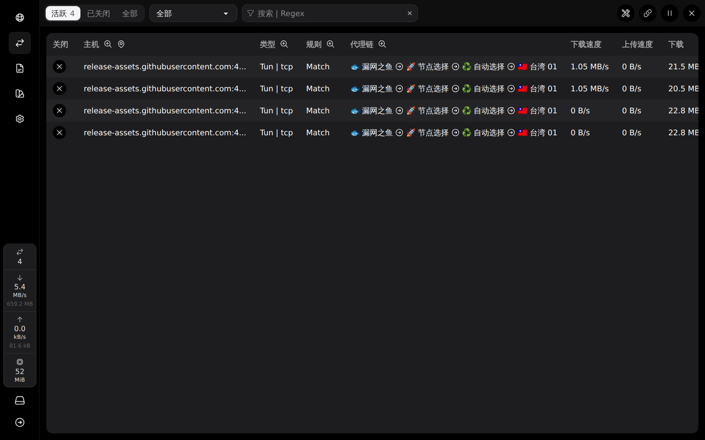</td>
    <td>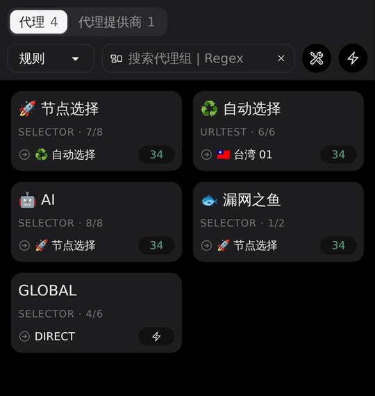</td>
  </tr>
  <tr>
    <td align="center"><sub>每条连接命中的规则和完整线路</sub></td>
    <td align="center"><sub>手机上打开面板</sub></td>
  </tr>
</table>

## 云端实测

在 OpenWrt 21.02.7（和 GL 固件同一版本）里按用户流程从头安装，局域网接一台模拟手机测试：

| 项目 | 结果 |
|---|---|
| 安装 | 连不上 GitHub 时约 65 秒（规则改由内核经代理下载）；装完 **2.5 秒**内局域网设备就能上网 |
| 内存 | 常驻约 **53MB**；40 并发、约 100MB 下载后仍是 50MB 左右 |
| DNS | 中位 **0.2ms**（fake-ip 在本地应答） |
| 打开网页 | 首字节 0.12 秒，直连同一节点是 0.14 秒，**没有额外延迟** |
| 下载速度 | 43–47 MB/s，约为直连同一节点的 **90%** |
| 分流 | ChatGPT / Claude / Gemini / Grok → 🤖 AI；百度 / B 站 / 淘宝 / QQ → 直连；Google / YouTube / GitHub → 代理 ✅ |
| 手机版 | 安卓配置启动后 2 秒下载好全部规则，分流结果同上，内存 48MB |
| 稳定性 | 崩溃自动拉起、看门狗自愈、升级保留配置、重启自启、卸载还原，全部通过 |

测试机是 x86_64，**还没在 GL-MT3600BE 真机上测过**。真机的 4 核 A53 单核比测试机慢不少：处理 100MB 流量测试机约用 1 秒 CPU，按此粗估，跑满百兆宽带约占 4 个核里的 1 个，日常上网、看视频负载很轻。装好后用 `litebox mem`、`top` 看实际情况。

## 下载

到 [Releases 页面](https://github.com/lyr05142002-dot/Q7Y/releases/latest) 下载，或直接点：

| 文件 | 说明 |
|---|---|
| [**litebox-arm64-offline.zip**](https://github.com/lyr05142002-dot/Q7Y/releases/latest/download/litebox-arm64-offline.zip) | **推荐**。已带 mihomo 内核和面板（约 23MB），路由器连不上 GitHub 也能装。适用于 GL-MT3600BE 等 aarch64 路由器 |
| [litebox.zip](https://github.com/lyr05142002-dot/Q7Y/releases/latest/download/litebox.zip) | 只有脚本（几十 KB），安装时再联网下载内核和面板，支持 aarch64 / armv7 / x86_64 |

也可以在路由器上用[一条命令安装](#方式二路由器上一条命令安装)（需要路由器能访问 GitHub）。手机见[手机版](#手机版)。

## 为什么不直接装 Open-Box

| | GL-MT3600BE 实际情况 | Open-Box 要求 |
|---|---|---|
| CPU | MT7987A，4×Cortex-A53（`ARMv8 Processor rev 4`，aarch64） | aarch64 ✅ |
| 系统 | GL 官方固件 = OpenWrt 21.02，fw3 / iptables，musl 1.1.x | OpenWrt 24+、musl ≥ 1.2.4（安装脚本直接拒绝更老的系统），nftables ❌ |
| 内存 | 512MB | 要求 512MB 内存、512MB 存储，常驻 Node.js 面板 |

Open-Box 的面板和 App 是闭源的，没法改，所以 LiteBox 全部用开源组件，从头写了安装和管理脚本（**没有复制 Open-Box 的代码**）：

| 组件 | 作用 | 来源 |
|---|---|---|
| [mihomo](https://github.com/MetaCubeX/mihomo) v1.19.31 | 代理内核：订阅、分组、分流、DNS、tun 透明代理 | 官方 Release，SHA256 写死在 `install.sh` 里校验 |
| [zashboard](https://github.com/Zephyruso/zashboard) v3.29.1 | 网页面板（无字体版，约 2.7MB），由内核直接提供，不另起进程 | 官方 Release，同样校验 SHA256 |
| 分流规则 | AI / 直连 / 代理域名集 + 国内域名和 IP 段 | [liandu2024/clash](https://github.com/liandu2024/clash/tree/main/list)、[MetaCubeX/meta-rules-dat](https://github.com/MetaCubeX/meta-rules-dat) |

Open-Box 有些做法很实用，LiteBox 用自己的方式实现了：

| Open-Box 的做法 | LiteBox 里 |
|---|---|
| 默认屏蔽走代理的 QUIC，浏览器退回 TCP，节点 UDP 差时更流畅 | 默认屏蔽，`litebox quic on/off` 切换；国内站点不受影响 |
| 「IP 只管 IP，域名只管域名」，不为匹配 IP 段去解析境外域名 | 国内 IP 规则加 `no-resolve` |
| 开着硬件流量卸载的联发科机器出问题时换 gvisor 协议栈 | `litebox stack gvisor`；`litebox doctor` 发现开着流量卸载会提示 |
| 安卓 App 的「本地分流」：手机按路由器同一套规则自己分流 | [手机版](#手机版)：安卓（FlClash / Clash Meta）和 iPhone（Shadowrocket）配置，不用装专门的 App |
| 一键升级 | `litebox update`（配置和订阅保留，下载包校验 SHA256） |

### 内存控制

- 不加载 GeoSite / GeoIP 数据库（国内规则改用体积小得多的 mrs 格式）、关闭进程查找
- `GOMEMLIMIT=100MiB`：接近 100MB 时 Go 运行时更积极地回收内存
- 看门狗：cron 每 5 分钟检查一次，常驻内存超过 **180MB** 自动重启内核

两个上限都在 `/etc/litebox/litebox.conf` 里改（`MEM_SOFT_MB`、`MEM_HARD_MB`），改完 `litebox restart`。

## 图文安装教程

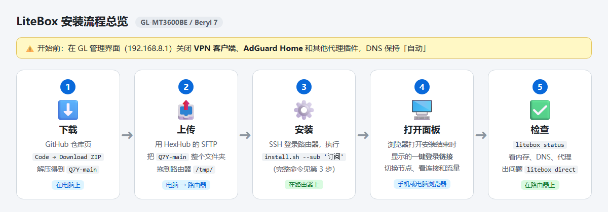

### 准备

在 GL 管理界面（默认 http://192.168.8.1）里：

1. 关闭 GL 自带的 VPN 客户端、AdGuard Home，以及其他代理插件（OpenClash、Passwall 等），否则会和 LiteBox 抢流量和 DNS
2. 「网络 → DNS」保持自动，不要设成手动 / 加密 DNS
3. 确认能用 SSH 登录路由器：用户名 `root`，密码和管理界面相同
4. 第一次安装时，最好用网线连着路由器，出问题时方便恢复

### 第 1 步：在电脑上下载安装包

打开 [Releases 页面](https://github.com/lyr05142002-dot/Q7Y/releases/latest)，下载 **litebox-arm64-offline.zip**，然后解压：

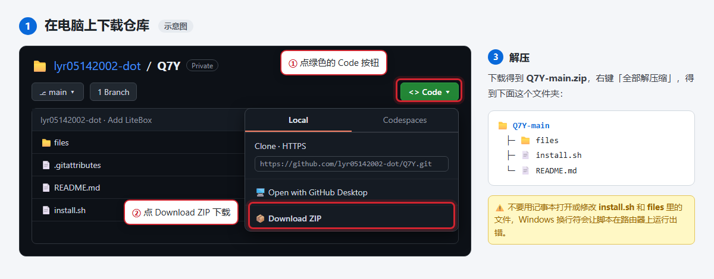

### 第 2 步：把文件夹传到路由器

用 [HexHub](https://www.hexhub.cn/) 连上路由器，在 SFTP 页面把整个 `litebox` 文件夹拖到路由器的 `/tmp/` 目录：

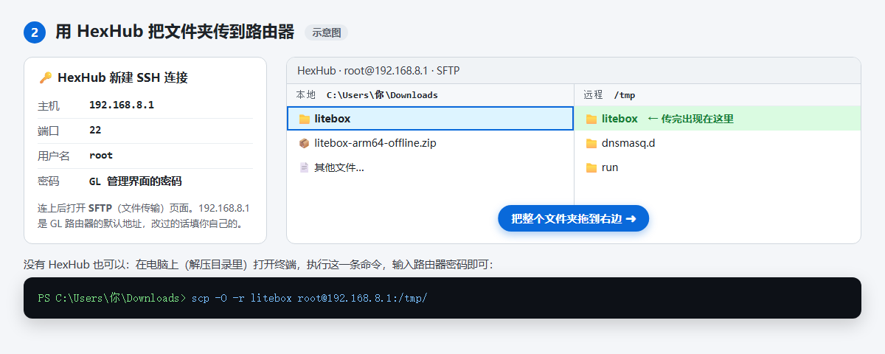

没有 HexHub 的话，在解压目录里打开终端执行：

```bash
scp -O -r litebox root@192.168.8.1:/tmp/
```

### 第 3 步：SSH 登录路由器，运行安装脚本

```bash
sh /tmp/litebox/install.sh --sub '你的机场订阅地址'
```

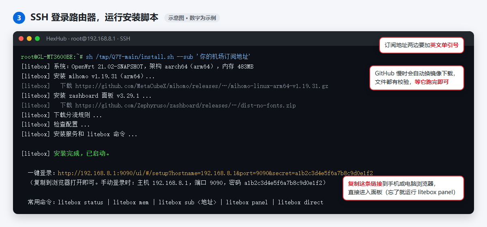

- 订阅支持 Clash / mihomo 格式，也支持 base64 节点链接
- 不加 `--sub` 也能装，安装时会询问；直接回车跳过的话，装好后不会启动，**网络不受影响**，之后执行 `litebox sub '订阅地址'` 就会启动
- 离线包里的内核和面板会优先使用，同样校验 SHA256；分流规则仍需联网下载，下载失败时内核启动后会经代理重试
- 用只有脚本的 `litebox.zip` 时，路由器访问 GitHub 慢，脚本会自动依次尝试 `ghfast.top`、`gh-proxy.com` 镜像；因为校验值写死在脚本里，镜像站换不了文件内容。也可以用 `--mirror https://你的镜像` 指定
- 面板端口默认 9090，被占用时加 `--port 9091`

### 第 4 步：打开网页面板

最省事的办法是复制安装结束时显示的**一键登录链接**，在手机或电脑浏览器里打开，会自动填好并进入面板。链接找不到了，就在路由器上运行 `litebox panel`。也可以按下图手动填写：

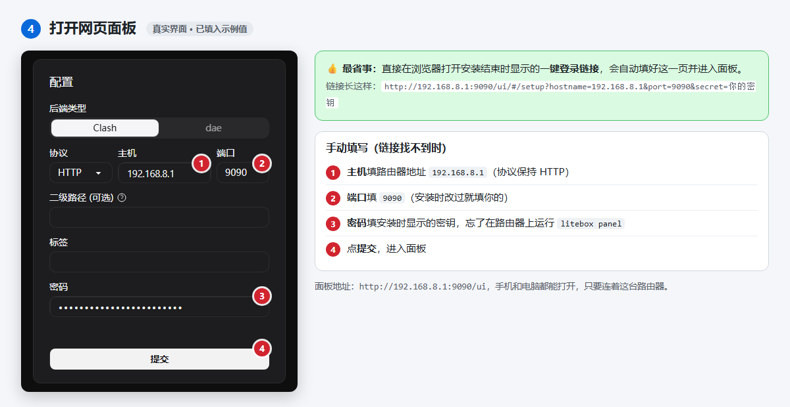

进入面板后，在「代理」页切换节点：

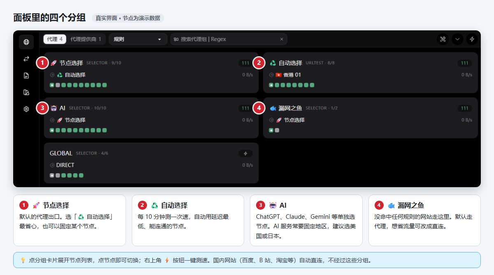

### 第 5 步：检查是否正常工作

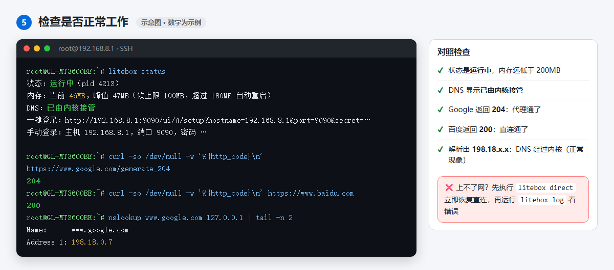

也可以在路由器上运行一键自检，它会逐项检查内核、配置、订阅节点、防火墙、DNS 接管、国内外网站连通和内存，每个失败项后面都写了怎么处理：

```bash
litebox doctor
```

```
[2] 流量和 DNS 接管
  [ OK ] 防火墙 litebox 区域已添加
  [ OK ] 虚拟网卡 litebox0 已创建
  [ OK ] dnsmasq 已把查询转给内核（127.0.0.1#1053）
  [ OK ] 域名解析经过内核（返回 198.18.x.x 是正常的）

[3] 网络连通（路由器自己访问）
  [ OK ] 国内网站（百度）正常
  [失败] 打不开 Google（000），当前节点不通
         → 在面板「代理」页换一个节点或点测速；全部超时说明订阅过期或机场故障
```

**上不了网时**，先执行 `litebox direct` 恢复直连，再运行 `litebox doctor`，把输出整段发出来求助。输出里不含订阅地址和面板密码，日志里的网址只保留域名。

### 方式二：路由器上一条命令安装

路由器能访问 GitHub 时，不用经过电脑，SSH 登录后执行：

```bash
curl -fsSL https://raw.githubusercontent.com/lyr05142002-dot/Q7Y/main/get.sh | sh -s -- --sub '你的机场订阅地址'
```

访问 GitHub 不畅时，经镜像下载：

```bash
curl -fsSL https://ghfast.top/https://raw.githubusercontent.com/lyr05142002-dot/Q7Y/main/get.sh | sh -s -- --mirror https://ghfast.top --sub '你的机场订阅地址'
```

它会下载最新版的 `litebox.tar.gz`，校验 SHA256（校验值优先直接从 GitHub 取），然后运行同一个 `install.sh`，参数原样传过去。装好后从第 4 步继续。

## 手机版

和路由器**同一套分组和分流规则**（国内直连、AI 单独选节点、屏蔽走代理的 QUIC），在外面用流量也一样分流。手机自己连机场节点，不经过家里的路由器。

**最简单：手机浏览器打开 <https://lyr05142002-dot.github.io/Q7Y/>**，按页面提示操作。安卓填订阅地址就能生成配置文件，订阅地址只在手机浏览器里处理、不会上传；iPhone 一键导入 Shadowrocket。

<p>
  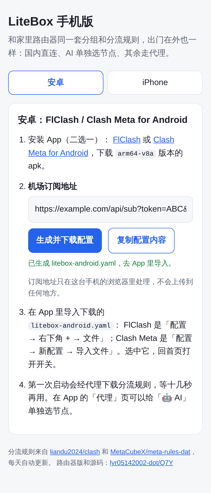
  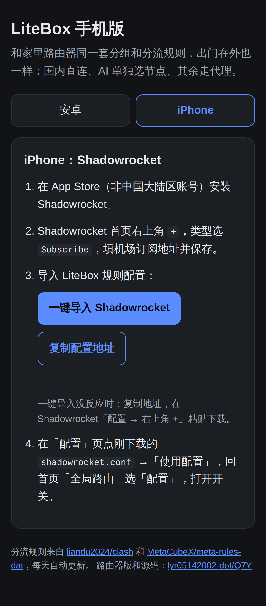
</p>

**安卓**（[FlClash](https://github.com/chen08209/FlClash/releases/latest) 或 [Clash Meta for Android](https://github.com/MetaCubeX/ClashMetaForAndroid/releases/latest)，下载 `arm64-v8a` 版本）：

1. 在上面的页面填订阅地址，点「生成并下载配置」，得到 `litebox-android.yaml`
   （也可以下载 [android.yaml](docs/mobile/android.yaml)，把里面的 `__SUB_URL__` 换成订阅地址）
2. App 里导入这个文件：FlClash「配置 → + → 文件」，Clash Meta「配置 → 新配置 → 导入文件」
3. 选中它，打开开关。第一次启动会经代理下载规则，等十几秒

**iPhone**（Shadowrocket）：

1. Shadowrocket 首页右上角 `+`，类型选 `Subscribe`，填订阅地址
2. 「配置」页右上角 `+`，粘贴下面的地址并下载，然后点它「使用配置」：
   ```
   https://raw.githubusercontent.com/lyr05142002-dot/Q7Y/main/docs/mobile/shadowrocket.conf
   ```
3. 首页「全局路由」选「配置」，打开开关

在家连着装了 LiteBox 的 Wi-Fi 时，手机上的代理可以关掉，路由器已经在分流了。

> 安卓配置在云端用 mihomo 内核实际跑过（FlClash / Clash Meta 用的就是 mihomo）：规则 2 秒下载完，分流正确。还没在真手机上测过；Shadowrocket 配置是按它的格式写的，没法在云端运行，有问题请反馈。

## 分组和分流

| 分组 | 用途 |
|---|---|
| 🚀 节点选择 | 默认代理出口：可选「♻️ 自动选择」、直连或任意节点 |
| ♻️ 自动选择 | 每 10 分钟测一次速，自动选延迟最低的节点 |
| 🤖 AI | ChatGPT / Claude / Gemini / Copilot / Grok 等单独选节点（AI 服务通常要固定地区） |
| 🐟 漏网之鱼 | 没命中任何规则的流量，默认走代理，可改直连 |

规则从上往下匹配：局域网直连 → 作者的直连名单 → 屏蔽走代理的 QUIC → AI 名单 → 作者的代理名单 → 国内域名直连 → 国内 IP 直连 → 其余走「漏网之鱼」。

国内 IP 规则带 `no-resolve`：有域名的连接只按域名判断，不在国内域名名单里的域名默认走代理（想直连就把「🐟 漏网之鱼」切成直连）。

规则文件每天自动更新一次。作者的名单里有少量他自己的域名和 IP，一般不影响使用。想调整规则的话，编辑 `/etc/litebox/config.yaml` 里的 `rules:`，然后执行 `litebox check && litebox restart`。

## 常用命令

| 命令 | 作用 |
|---|---|
| `litebox status` | 运行状态、当前 / 峰值内存、面板地址 |
| `litebox doctor` | **出问题时先跑这个**：一键自检并给出处理建议 |
| `litebox mem` | 详细内存信息 |
| `litebox sub '地址'` | 更换订阅（不带地址 = 查看当前订阅） |
| `litebox panel` | 显示面板的一键登录链接和密码 |
| `litebox restart` / `stop` / `start` | 重启 / 停止 / 启动 |
| `litebox log` | 最近的内核日志 |
| `litebox direct` | **上不了网时用**：立即恢复直连并关闭开机自启 |
| `litebox update` | 升级到最新版，配置和订阅保留（连不上 GitHub 时加 `--mirror https://ghfast.top`） |
| `litebox quic on` / `off` | 屏蔽 / 放行走代理的 QUIC（默认屏蔽） |
| `litebox stack gvisor` | 切换 TUN 协议栈（`system` 默认 / `gvisor` / `mixed`），开着硬件加速出问题时用 |
| `litebox uninstall` | 卸载（`--purge` 连配置和订阅一起删） |

升级：执行 `litebox update`；或下载新版安装包，按第 2、3 步重新执行 `install.sh`。配置、订阅、面板密钥都会保留。

升级时不会改动已有的 `config.yaml`。想用上新版模板里的改进（比如 QUIC 开关），执行 `litebox update --reset-config`：按新模板重新生成配置，订阅、端口、密钥保留，旧配置备份为 `config.yaml.old`。

**自动保护**：看门狗每 5 分钟检查一次。内核反复崩溃、系统放弃重启它时，看门狗会先试着拉起；拉不起来就恢复原来的 DNS，让家里设备直连上网，不会全家断网。内核恢复后自动重新接管。

## 工作原理

- **流量**：mihomo 创建 `litebox0` 虚拟网卡并接管路由（tun + auto-route），局域网设备的流量经它按规则分流；192.168.x.x 等内网地址不进内核
- **DNS**：dnsmasq 把查询转给内核（127.0.0.1:1053，fake-ip 模式）。启动时自动设置，停止或卸载时原样恢复（原设置备份在 `/etc/litebox/dnsmasq.bak`）
- **防火墙**：安装时添加 `litebox` 区域，并允许 lan → litebox 转发，卸载时删除
- **文件位置**：内核在 `/usr/lib/litebox/`，配置、规则、面板、订阅缓存在 `/etc/litebox/`

## 已知限制

- IPv6 流量不经过代理。GL 固件默认关闭 IPv6，建议保持关闭
- 访客网络（guest）默认不走代理
- 设备自己设置的 DoH（比如浏览器的「安全 DNS」）会绕过路由器 DNS，按 IP 分流时可能不准，建议关掉
- 按 GL 固件的 OpenWrt 21.02 设计，在云端的 OpenWrt 21.02.7 上完整测试过，**还没在 GL-MT3600BE 真机上验证**。第一次安装时建议留一根网线，出问题就执行 `litebox direct`

## 许可证

本仓库的脚本和配置模板由本仓库作者编写。

离线包里附带的第三方程序原样取自官方 Release，并附上各自的许可证原文（在 `licenses/` 目录）：

- [mihomo](https://github.com/MetaCubeX/mihomo) v1.19.31：GPL-3.0。对应源码见 [官方 v1.19.31 标签](https://github.com/MetaCubeX/mihomo/tree/v1.19.31)，本仓库的 Release 里也附了一份源码包
- [zashboard](https://github.com/Zephyruso/zashboard) v3.29.1：MIT

分流规则在安装时从 [liandu2024/clash](https://github.com/liandu2024/clash) 和 [MetaCubeX/meta-rules-dat](https://github.com/MetaCubeX/meta-rules-dat) 下载，不包含在安装包里。
