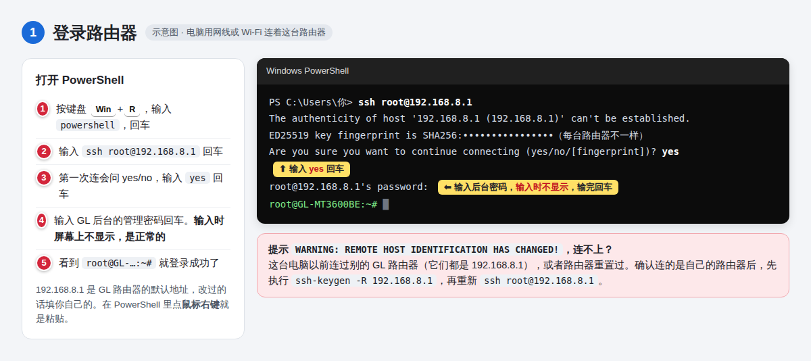
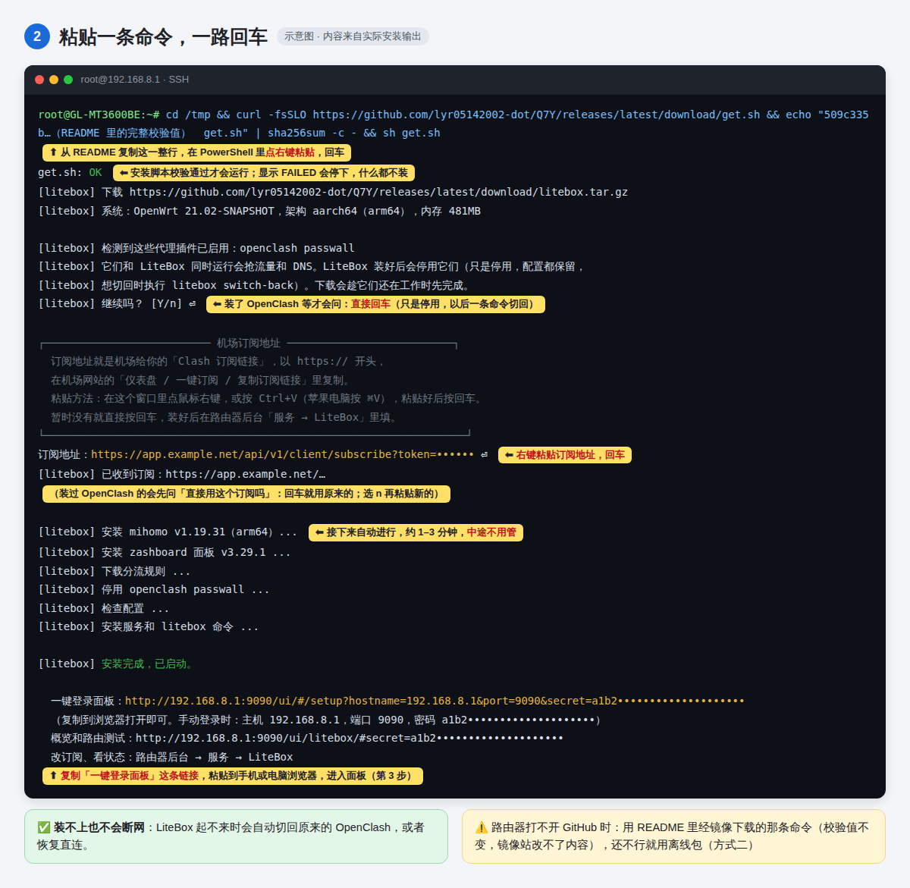
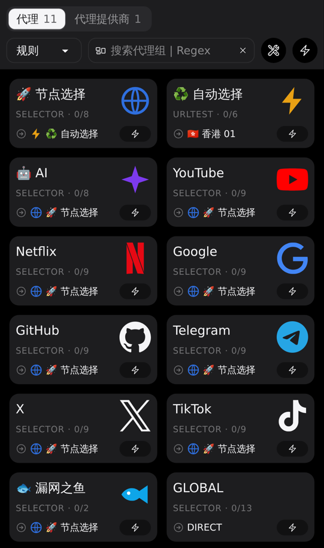
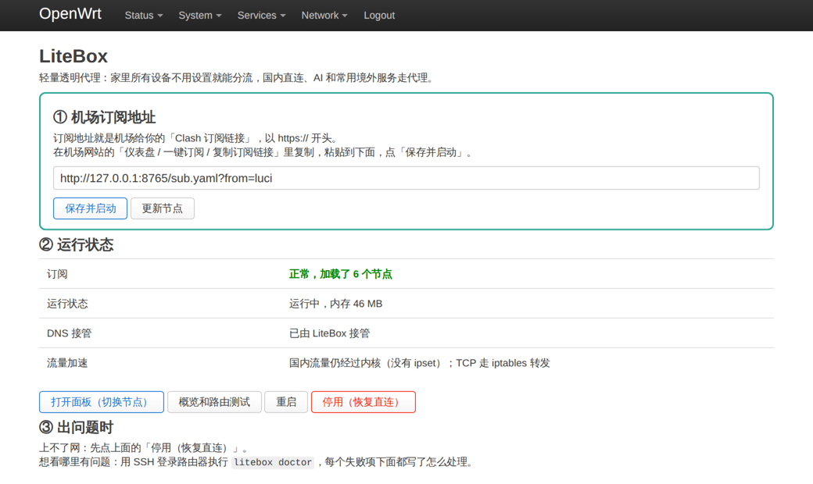
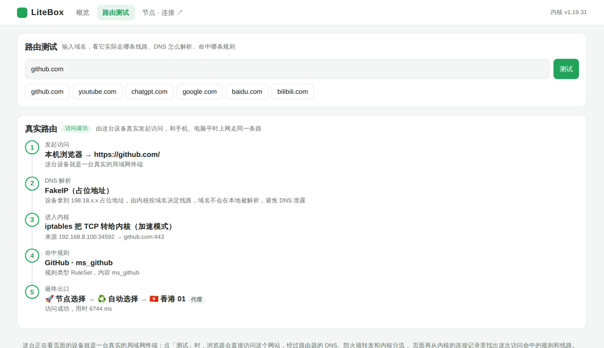
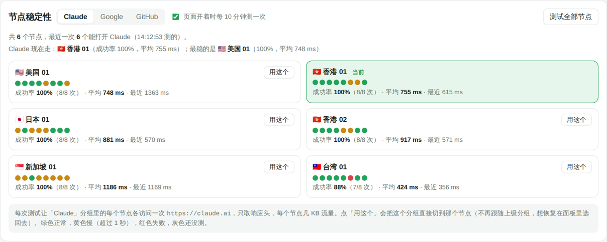
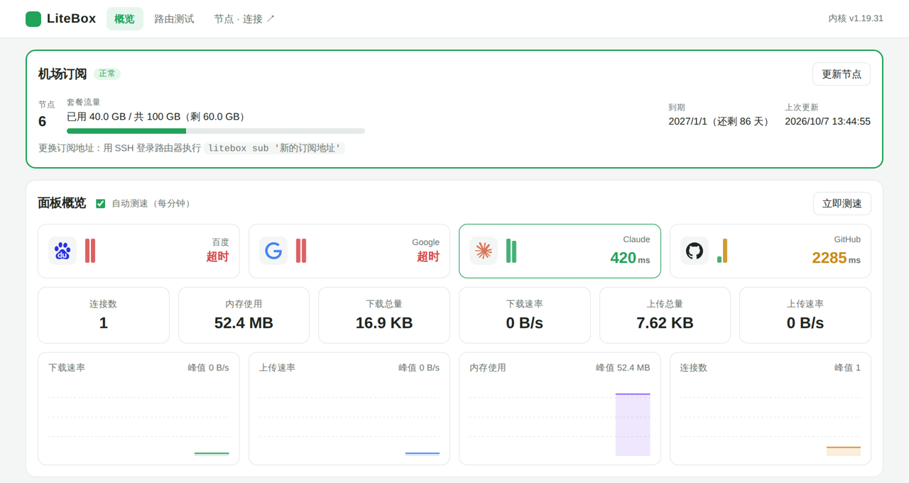
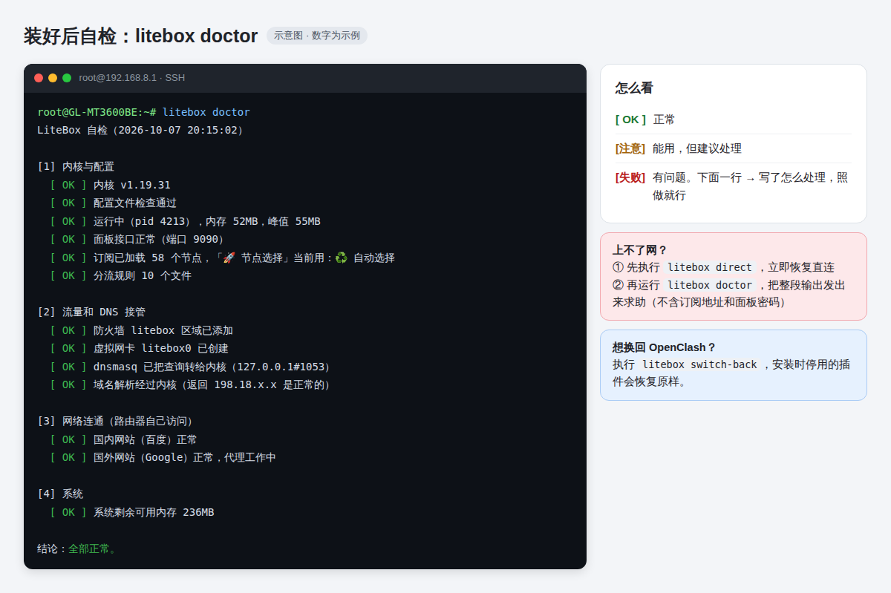
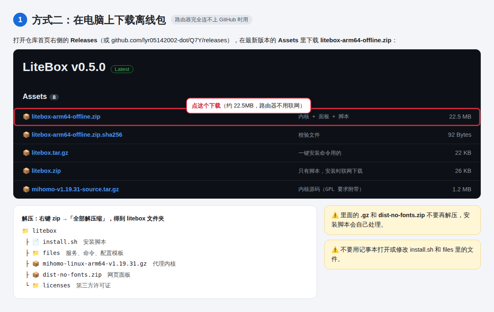

<div align="center">

# LiteBox

**给 GL.iNet GL-MT3600BE（Beryl 7）等小内存 OpenWrt 路由器用的轻量透明代理，附手机版**

家里所有设备不用任何设置就能分流：国内直连、AI 单独选节点、其余走代理。常驻内存约 50MB。

[](https://github.com/lyr05142002-dot/Q7Y/releases/latest)
[](https://github.com/lyr05142002-dot/Q7Y/actions/workflows/test.yml)

[下载](#下载) · [图文安装教程](#图文安装教程) · [**改订阅 / 换机场**](#改订阅--换机场) · [手机版](#手机版) · [常用命令](#常用命令) · [出问题怎么办](#装好后自检出问题怎么办)

</div>


<p align="center"><sub>路由器网页面板（zashboard），每个分组都带图标。截图来自云端测试环境，节点是演示数据</sub></p>

## 特点

- **一条命令装好**：登录路由器粘贴一条命令、一路回车。自动沿用 OpenClash 里已有的订阅、自动停用冲突插件，装不上自动切回原样
- **订阅在后台网页里填**：路由器后台多一个「服务 → LiteBox」页面，订阅框在最上面，粘贴、点保存就生效，还能看到节点数、套餐流量和到期日
- **GL 官方固件直接装**：GL 固件是 OpenWrt 21.02，[Open-Box](https://github.com/liandu2024/Open-Box) 要求 OpenWrt 24 以上装不了；LiteBox 专门按 21.02 写，不用刷机
- **国内流量不进内核**：国内网站直接从 WAN 出去，不占代理的 CPU，还能用上路由器的硬件加速；境外 TCP 走 iptables 转发，比 TUN 省约 70% CPU
- **省内存**：只有一个 mihomo 进程，常驻约 50MB，大流量下也不涨；超过上限自动重启
- **分流规则现成的**：用[视频作者](https://youtu.be/G_7AmjfSRQ8)的[域名集](https://github.com/liandu2024/clash/tree/main/list)，每天自动更新；ChatGPT / Claude / Gemini / Grok 等走单独的 🤖 AI 分组
- **概览和路由测试页**：四个站点的延迟走势、每个节点访问 Claude 的稳定性、连接 / 内存 / 流量实时曲线、规则命中统计、按月流量；输入域名就能看它实际走哪条线路、DNS 怎么解析、命中哪条规则
- **手机版**：安卓、iPhone 用同一套规则，出门在外也一样分流
- **出问题能自救**：`litebox doctor` 一键自检、`litebox direct` 一键恢复直连；内核起不来时看门狗自动恢复 DNS，不会全家断网
- **下载安全**：内核和面板锁定版本、校验 SHA256；每次发布前自动在 OpenWrt 21.02 里完整装一遍测试

<table>
  <tr>
    <td width="68%"></td>
    <td></td>
  </tr>
  <tr>
    <td align="center"><sub>每条连接命中的规则和完整线路</sub></td>
    <td align="center"><sub>手机上打开面板</sub></td>
  </tr>
</table>

## 测试情况

下面的数据分三类，分开写清楚：

**1. 真机（GL-MT3600BE，OpenWrt 21.02 第三方固件，aarch64，512MB 内存）**：只验证过 **v0.4.0**——加速层生效（国内 6206 个 IP 段不进内核、TCP 走 iptables 转发），内核内存 43MB（峰值 47MB），61 个节点，换下 OpenClash 后系统可用内存从 68MB 增加到 135MB。v0.5.0 以后的功能（概览页、路由测试、LuCI 页面、AI 分组、规则校验等）**还没在真机上跑过**。

**2. 云端 x86_64**（下表和后面「和 OpenClash 比」的数字都是这一类）：OpenWrt 21.02.7 / ImmortalWrt 的 x86_64 环境，按用户流程从头安装，局域网接一台模拟手机：

| 项目 | 结果 |
|---|---|
| 安装 | 连不上 GitHub 时约 65 秒；装完 **2.5 秒**内局域网设备就能上网 |
| 内存 | 常驻约 **53MB**；40 并发、约 100MB 下载后仍是 50MB 左右 |
| DNS | 中位 **0.2ms**（fake-ip 在本地应答） |
| 打开网页 | 首字节 0.12 秒，直连同一节点是 0.14 秒，**没有额外延迟** |
| 下载速度 | 43–47 MB/s，约为直连同一节点的 **90%** |
| 分流 | ChatGPT / Claude / Gemini / Copilot / Grok → 各自的 AI 分组；x.com → X，gstatic → Google；百度 / B 站 / 淘宝 / QQ → 直连；YouTube / GitHub → 各自分组 ✅ |
| 规则更新 | 下载到出错网页、空文件、格式不对、比上一版少一半以上时都不替换，旧规则照常生效 ✅ |
| 稳定性 | 崩溃自动拉起、看门狗自愈、升级保留配置、重启自启、卸载还原；自动测试每次发布前跑一遍（160 多项） |

x86 测试机比真机快得多：处理 100MB 流量测试机约用 1 秒 CPU，真机的 4 核 A53 单核慢不少，按此粗估跑满百兆宽带约占 4 个核里的 1 个。装好后用 `litebox mem`、`top` 看实际情况。

**3. 还没实机验证的**：

- **手机版**：安卓配置只在云端用 mihomo 内核跑过（FlClash / Clash Meta 用的是同一个内核），**没在真手机上测过**；**Shadowrocket 配置没法在云端运行，完全没验证过**
- **GL 官方固件**（没刷第三方固件的 GL-MT3600BE）上的完整安装
- 路由器后台的 LiteBox 页面只在 x86 的 OpenWrt 21.02.7 自带 LuCI 上测过，没在 GL 固件的 LuCI、iStoreOS 上测过

用了的话欢迎把 `litebox doctor` 的输出发上来（不含订阅地址和面板密码）。

## 和 OpenClash 比

（云端 x86 数据）在云端同一台测试路由器、同一部测试手机上，用同一个 mihomo 内核（v1.19.31）、同一份订阅和分流规则，依次装 LiteBox 和最新的 OpenClash（v0.47.156，fake-ip 模式），下载同一个 22MB 文件，记录代理内核用掉的 CPU：

| | 国内网站：内核 CPU / 速度 | 境外网站：内核 CPU | 内存 |
|---|---|---|---|
| **LiteBox v0.4（默认）** | **0ms** / 1050–1310 MB/s | **70–80ms** | 51MB |
| OpenClash 默认设置 | 20–30ms / 420–740 MB/s | 60–70ms | 51MB |
| OpenClash 开「绕过中国大陆 IP」 | 0ms / 1220–1490 MB/s | 80–130ms | 51MB |
| LiteBox v0.3 及以前（只用 TUN） | 210–340ms / 75–114 MB/s | 270–390ms | 50MB |

其他方面：

| 项目 | LiteBox | OpenClash | 说明 |
|---|---|---|---|
| 新域名 DNS 解析 | **0.8ms** | 24ms | OpenClash 默认打开 `store-fake-ip`（把每个 fake-ip 映射存下来），LiteBox 关掉了：把 LiteBox 也打开后同样变成 23ms，存到内存里也一样慢（见「已知限制」） |
| 重启到恢复代理 | **6–7 秒** | 9–10 秒 | |
| 占用存储（不含内核） | **约 6MB** | 约 25MB，另需 Ruby、bash、dnsmasq-full 等依赖 | |
| 功能 | 够用：分组、分流、面板、自检 | **多得多**：订阅转换、覆写、多种代理模式、LuCI 页面里改各种设置 | |

简单说：**同一个内核，速度、内存一样**；LiteBox 开箱就是 OpenClash 调好之后的水平（国内不进内核、境外走 iptables 转发），DNS 更快、更省存储、装和管更简单；OpenClash 功能更全。已经在用 OpenClash 而且满意的，没必要换。

## 下载

**一般不用手动下载**：登录路由器后粘贴一条命令就能装，见[图文安装教程](#图文安装教程)。

路由器完全连不上 GitHub 时，到 [Releases 页面](https://github.com/lyr05142002-dot/Q7Y/releases/latest) 下载离线包：

| 文件 | 说明 |
|---|---|
| [litebox-arm64-offline.zip](https://github.com/lyr05142002-dot/Q7Y/releases/latest/download/litebox-arm64-offline.zip) | 已带 mihomo 内核和面板（约 23MB），路由器不用联网。适用于 GL-MT3600BE 等 aarch64 路由器 |
| [litebox.zip](https://github.com/lyr05142002-dot/Q7Y/releases/latest/download/litebox.zip) | 只有脚本（几十 KB），安装时再联网下载内核和面板，支持 aarch64 / armv7 / x86_64 |

手机见[手机版](#手机版)。

## 为什么不直接装 Open-Box

| | GL-MT3600BE 实际情况 | Open-Box 要求 |
|---|---|---|
| CPU | MT7987A，4×Cortex-A53（`ARMv8 Processor rev 4`，aarch64） | aarch64 ✅ |
| 系统 | GL 官方固件 = OpenWrt 21.02，fw3 / iptables，musl 1.1.x | OpenWrt 24+、musl ≥ 1.2.4（安装脚本直接拒绝更老的系统），nftables ❌ |
| 内存 | 512MB | 要求 512MB 内存、512MB 存储，常驻 Node.js 面板 |

Open-Box 的面板和 App 是闭源的，没法改，所以 LiteBox 全部用开源组件，从头写了安装和管理脚本（**没有复制 Open-Box 的代码**）：

| 组件 | 作用 | 来源 |
|---|---|---|
| [mihomo](https://github.com/MetaCubeX/mihomo) v1.19.31 | 代理内核：订阅、分组、分流、DNS、tun 透明代理 | 官方 Release，SHA256 写死在 `install.sh` 里校验 |
| [zashboard](https://github.com/Zephyruso/zashboard) v3.29.1 | 网页面板（无字体版，约 2.7MB），由内核直接提供，不另起进程 | 官方 Release，同样校验 SHA256 |
| 分流规则 | AI / 直连 / 代理域名集 + YouTube、Google 等常用服务 + 国内域名和 IP 段 | [liandu2024/clash](https://github.com/liandu2024/clash/tree/main/list)、[MetaCubeX/meta-rules-dat](https://github.com/MetaCubeX/meta-rules-dat) |

Open-Box 有些做法很实用，LiteBox 用自己的方式实现了：

| Open-Box 的做法 | LiteBox 里 |
|---|---|
| 默认屏蔽走代理的 QUIC，浏览器退回 TCP，节点 UDP 差时更流畅 | 默认屏蔽，`litebox quic on/off` 切换；国内站点不受影响 |
| 「IP 只管 IP，域名只管域名」，不为匹配 IP 段去解析境外域名 | 国内 IP 规则加 `no-resolve` |
| 开着硬件流量卸载的联发科机器出问题时换 gvisor 协议栈 | `litebox stack gvisor`；`litebox doctor` 发现开着流量卸载会提示 |
| 安卓 App 的「本地分流」：手机按路由器同一套规则自己分流 | [手机版](#手机版)：安卓（FlClash / Clash Meta）和 iPhone（Shadowrocket）配置，不用装专门的 App |
| 一键升级 | `litebox update`（配置和订阅保留，安装脚本和安装包都先校验 SHA256） |
| 直连不进内核 | 国内域名返回真实 IP，国内 IP 由防火墙直接放行走 WAN；境外 TCP 用 iptables 转发（`litebox accel on/off`） |

### 内存控制

- 不加载 GeoSite / GeoIP 数据库（国内规则改用体积小得多的 mrs 格式）、关闭进程查找
- `GOMEMLIMIT=100MiB`：接近 100MB 时 Go 运行时更积极地回收内存
- 看门狗：cron 每 5 分钟检查一次（间隔可改，见下面「看门狗」），常驻内存超过 **180MB** 自动重启内核

两个上限都在 `/etc/litebox/litebox.conf` 里改（`MEM_SOFT_MB`、`MEM_HARD_MB`），改完 `litebox restart`。

## 图文安装教程


**开始前**：电脑用网线或 Wi-Fi 连着这台路由器。在 GL 管理后台（http://192.168.8.1）关掉 GL 自带的 VPN 客户端和 AdGuard Home。装过 OpenClash、Passwall 的**不用自己处理**，安装时会自动停用（配置保留，随时能切回）。

### 第 1 步：登录路由器

电脑按 <kbd>Win</kbd>+<kbd>R</kbd>，输入 `powershell` 回车，在打开的窗口里输入：

```
ssh root@192.168.8.1
```

问 yes/no 就输入 `yes`，然后输入 GL 后台的管理密码（**输入时不显示**，输完回车）。



提示 `REMOTE HOST IDENTIFICATION HAS CHANGED` 连不上：先执行 `ssh-keygen -R 192.168.8.1`，再重新登录。

### 第 2 步：粘贴一条命令，一路回车

**推荐：先下载、校验、再执行。** 复制下面这一整行，在 PowerShell 窗口里**点鼠标右键**粘贴，回车：

```
cd /tmp && curl -fsSLO https://github.com/lyr05142002-dot/Q7Y/releases/latest/download/get.sh && echo "509c335bbcef9d98bd8bc56d2174dc920e83179284be931a2740c7e621b89d4a  get.sh" | sha256sum -c - && sh get.sh
```

它先下载安装脚本 `get.sh`，核对 SHA256 和上面写的一致（显示 `get.sh: OK`）才运行；对不上会显示 `FAILED` 并停下，什么都不会装。`get.sh` 再去下载安装包，同样校验 SHA256 后才安装。

<details>
<summary>想自己一步步来，或者核对校验值</summary>

```
cd /tmp
curl -fsSLO https://github.com/lyr05142002-dot/Q7Y/releases/latest/download/get.sh
sha256sum get.sh
```

看到的值应该是 `509c335bbcef9d98bd8bc56d2174dc920e83179284be931a2740c7e621b89d4a`。每个版本 Release 页面的说明末尾也列了 `get.sh` 和所有文件的校验值，还附了一个 `SHA256SUMS` 文件。一致再执行 `sh get.sh`。

</details>

**快速方式**（不校验入口脚本，图省事用；安装包本身仍会校验）：

```
curl -fsSL https://raw.githubusercontent.com/lyr05142002-dot/Q7Y/main/get.sh | sh
```

接下来它会问两件事：

1. 检测到 OpenClash / Passwall 等：**直接回车**，停用它们（只是停用，下载会趁它们还在工作时先完成）
2. **机场订阅地址**：
   - 检测到 OpenClash 里已有的订阅时，问「直接用这个订阅吗」：**回车**就用它；想换一个就输入 `n` 回车，再粘贴新的
   - 没检测到时会显示一个说明框，让你粘贴：在机场网站找「**复制订阅链接**」（也叫 Clash 订阅、一键订阅），复制后在 PowerShell 窗口里**点鼠标右键**粘贴，回车。粘错了（不是 `https://` 开头）会让你重新粘
   - 暂时没有订阅就直接回车跳过，装好后按下面的「[改订阅 / 换机场](#改订阅--换机场)」再填

然后等 1–3 分钟，看到「安装完成，已启动」就好了。



- **装不上也不会断网**：LiteBox 起不来时会自动切回原来的 OpenClash，或者恢复直连
- 路由器打不开 GitHub 时，经镜像下载（校验值不变，镜像站改不了内容）；还不行就用后面的[离线包](#方式二离线包路由器完全连不上-github-时)：
  ```
  cd /tmp && curl -fsSLO https://ghfast.top/https://github.com/lyr05142002-dot/Q7Y/releases/latest/download/get.sh && echo "509c335bbcef9d98bd8bc56d2174dc920e83179284be931a2740c7e621b89d4a  get.sh" | sha256sum -c - && sh get.sh --mirror https://ghfast.top
  ```

### 第 3 步：打开面板

把安装完显示的**一键登录链接**复制到手机或电脑浏览器，会自动填好并进入面板。链接找不到了，在路由器上运行 `litebox panel`。也可以按下图手动填：


进入面板后在「代理」页切换节点：



### 改订阅 / 换机场

**方法一：在路由器后台网页里改（推荐）**

浏览器打开路由器后台（OpenWrt / iStoreOS 是 `http://192.168.8.1` 或你平时进的地址），菜单 **服务 → LiteBox**。最上面就是订阅地址框：粘贴新的订阅地址，点「**保存并启动**」，十几秒后下面会显示加载了多少个节点、套餐还剩多少流量、什么时候到期。



<sub>截图来自云端测试用的 OpenWrt 21.02.7（自带 LuCI），订阅地址是演示数据。这个页面需要 LuCI 21.02 或更新版本（iStoreOS、ImmortalWrt 21.02+、OpenWrt 21.02+、GL 固件里装了 LuCI 的都行），安装时自动加上。第一次打开如果提示没有权限，退出后台重新登录一次。</sub>

**方法二：一条命令**

SSH 登录路由器（第 1 步），执行（把地址换成你的，**保留两边的单引号**）：

```
litebox sub '你的订阅地址'
```

它会自动去掉多复制的空格和引号，保存后重启并告诉你加载了几个节点。只想重新拉一次节点（机场更新了节点列表）：后台页面点「更新节点」，或者执行 `litebox sub-update`。

概览页最上面也有一张「机场订阅」卡片，显示节点数、套餐流量、到期日，有「更新节点」按钮。

### 概览和路由测试

安装完还会显示一个**概览和路由测试**链接（`litebox panel` 也能看到），形如 `http://192.168.8.1:9090/ui/litebox/#secret=面板密码`。面板顶部的「节点 · 连接」可以跳回 zashboard。

- **概览**：机场订阅卡片（节点数、套餐流量、到期日）；百度 / Google / Claude / GitHub 的延迟和最近 24 次走势（分别经直连和 Google、Claude、GitHub 分组测，和平时访问走同一条线）；连接数、内存、上下行速率的实时曲线；规则命中排行和代理 / 直连占比；按月、按天的流量
- **节点稳定性**：每个节点访问 Claude（也能切到 Google、GitHub）的成功率、平均延迟和最近 20 次结果，一个点一次：绿色正常、黄色慢（超过 1 秒）、红色失败。标出当前在用的节点和最稳的节点，点「用这个」就把 Claude 分组切过去。页面开着时每 10 分钟自动测一次，也可以点「测试全部节点」；点概览里的 Claude 卡片也会跳到这里
- **路由测试**：输入域名，浏览器真实访问一次，页面从内核记录里找出这次访问的 DNS 方式、进入内核的方式、命中的规则和完整线路。正在看页面的这台手机或电脑本身就是局域网终端，所以不用另外模拟设备





<sub>每次测试让分组里的每个节点各访问一次网站，只取响应头，每个节点几 KB 流量。最近 10 次结果记在路由器内核里，换手机、电脑打开也看得到；更早的存在这台设备的浏览器里。截图来自测试环境，节点是演示数据。</sub>

<details><summary>概览页截图（测试环境不通百度和 Google，所以这两个显示超时）</summary>



</details>

流量记录说明：看门狗每 5 分钟记一次经过内核的流量，平时写在内存里、每小时存回闪存一次。开着流量加速时国内 IP 不进内核，不计入。

### 装好后自检、出问题怎么办

在路由器上运行 `litebox doctor`，它会逐项检查，每个失败项下面都写了怎么处理：



| 遇到的情况 | 执行 |
|---|---|
| 上不了网 | `litebox direct`（立即恢复直连），再把 `litebox doctor` 的输出发出来求助（不含订阅地址和面板密码） |
| 想换回 OpenClash | `litebox switch-back`（安装时停用的插件恢复原样） |
| 升级到新版 | `litebox update` |

### 方式二：离线包（路由器完全连不上 GitHub 时）

**1. 在电脑上下载** [litebox-arm64-offline.zip](https://github.com/lyr05142002-dot/Q7Y/releases/latest/download/litebox-arm64-offline.zip)，右键「全部解压缩」，得到 `litebox` 文件夹。想核对下载的文件：PowerShell 里执行 `certutil -hashfile litebox-arm64-offline.zip SHA256`，和 Release 页面列的校验值比一下：



**2. 传到路由器**：用 [HexHub](https://www.hexhub.cn/) 的 SFTP 把整个 `litebox` 文件夹拖到路由器的 `/tmp/`，或者在解压目录里打开 PowerShell 执行 `scp -O -r litebox root@192.168.8.1:/tmp/`（提示 `-O` 不认识就去掉 `-O`）：


**3. 登录路由器执行**下面这行，同样一路回车，之后从[第 3 步](#第-3-步打开面板)继续：

```
sh /tmp/litebox/install.sh
```

<details>
<summary>高级选项</summary>

- `--sub '订阅地址'`：直接指定订阅，不再询问。订阅支持 Clash / mihomo 格式和 base64 节点链接
- `--yes`：所有问题按默认回答（用检测到的订阅、停用冲突插件），适合无人值守
- `--mirror https://你的镜像`：指定 GitHub 镜像。内核和面板的 SHA256 写死在脚本里，镜像站换不了文件内容
- `--port 9091`：面板端口（默认 9090）
- 一条命令的方式：`get.sh` 下载最新版的 `litebox.tar.gz`，校验 SHA256（校验值优先直接从 GitHub 取）后运行同一个 `install.sh`，参数原样传过去
</details>

## 手机版

和路由器**同一套分组和分流规则**（国内直连、AI 单独选节点、屏蔽走代理的 QUIC），在外面用流量也一样分流。手机自己连机场节点，不经过家里的路由器。

**最简单：手机浏览器打开 [lyr05142002-dot.github.io/Q7Y](https://lyr05142002-dot.github.io/Q7Y/)**，按页面提示操作。安卓填订阅地址就能生成配置文件，订阅地址只在手机浏览器里处理、不会上传；iPhone 一键导入 Shadowrocket。地址：

```
https://lyr05142002-dot.github.io/Q7Y/
```

<p>
  
  
</p>

**安卓**（[FlClash](https://github.com/chen08209/FlClash/releases/latest) 或 [Clash Meta for Android](https://github.com/MetaCubeX/ClashMetaForAndroid/releases/latest)，下载 `arm64-v8a` 版本）：

1. 在上面的页面填订阅地址，点「生成并下载配置」，得到 `litebox-android.yaml`
   （也可以下载 [android.yaml](docs/mobile/android.yaml)，把里面的 `__SUB_URL__` 换成订阅地址）
2. App 里导入这个文件：FlClash「配置 → + → 文件」，Clash Meta「配置 → 新配置 → 导入文件」
3. 选中它，打开开关。第一次启动会经代理下载规则，等十几秒

**iPhone**（Shadowrocket）：

1. Shadowrocket 首页右上角 `+`，类型选 `Subscribe`，填订阅地址
2. 「配置」页右上角 `+`，粘贴下面的地址并下载，然后点它「使用配置」：
   ```
   https://raw.githubusercontent.com/lyr05142002-dot/Q7Y/main/docs/mobile/shadowrocket.conf
   ```
3. 首页「全局路由」选「配置」，打开开关

在家连着装了 LiteBox 的 Wi-Fi 时，手机上的代理可以关掉，路由器已经在分流了。

> **都还没在真手机上验证过。** 安卓配置在云端用 mihomo 内核实际跑过（FlClash / Clash Meta 用的就是 mihomo）：规则 2 秒下载完，分流正确。Shadowrocket 配置是按它的格式写的，没法在云端运行，完全没验证过。有问题请反馈。

## 分组和分流

| 分组 | 用途 |
|---|---|
| 🚀 节点选择 | 默认代理出口：可选「♻️ 自动选择」、直连或任意节点 |
| ♻️ 自动选择 | 每 10 分钟测一次速，自动选延迟最低的节点 |
| 🤖 AI | AI 服务的总开关：ChatGPT / Claude / Gemini / Copilot / Grok 默认都跟着它；作者 AI 名单里的其他 AI 服务（Groq、Genspark、Dify 等）也走它。AI 服务通常要固定地区，在这里选一个就行 |
| ChatGPT、Claude、Gemini、Copilot、Grok | 常用 AI 各一个分组，带图标，默认跟随「🤖 AI」；想让某一个单独走别的节点（比如 Claude 用美国、Gemini 用新加坡）就改它 |
| YouTube、Netflix、Google、GitHub、Telegram、X、TikTok | 常用境外应用各一个分组，带应用图标，默认跟随「🚀 节点选择」；想让某个应用单独走某个节点（比如 Netflix 选解锁好的地区）就在面板里改它 |
| 🐟 漏网之鱼 | 没命中任何规则的流量，默认走代理，可改直连 |

规则从上往下匹配：局域网直连 → 作者的直连名单 → 屏蔽走代理的 QUIC → ChatGPT / Claude / Gemini / Copilot / Grok 名单（各自的分组）→ YouTube / Netflix / Google / GitHub / Telegram / X / TikTok（各自的分组）→ 其余 AI 名单（🤖 AI）→ 作者的代理名单 → 国内域名直连 → 国内 IP 直连 → 其余走「漏网之鱼」。

YouTube、Netflix、Google、GitHub、Telegram、X（Twitter）、TikTok 的规则来自 [MetaCubeX/meta-rules-dat](https://github.com/MetaCubeX/meta-rules-dat)（mrs 格式，每个只有几 KB），手机版 Shadowrocket 用的是 [blackmatrix7/ios_rule_script](https://github.com/blackmatrix7/ios_rule_script) 里对应的列表。手机版为了界面简洁，YouTube 和 Netflix 合成一个「📺 流媒体」分组，其余应用跟随「🚀 节点选择」。

国内 IP 规则带 `no-resolve`：有域名的连接只按域名判断，不在国内域名名单里的域名默认走代理（想直连就把「🐟 漏网之鱼」切成直连）。

### 规则怎么更新

每天凌晨 4 点多由 `litebox rules-update` 下载一次（也可以手动执行），每个规则文件都先校验：

- 下载失败、下载到的是**空文件**或**网页**（比如出错页面）、格式不对（文本名单里不到 90% 的行像规则，mrs 文件开头不对）、**比上一版少了一半以上**（多半是下载不完整），都**不替换**，继续用旧版
- 通过了才替换文件（先写到同一目录再改名，一步完成），然后只让内核重读这一个规则集：**不重启、不断开连接**
- 结果写进系统日志（`logread | grep 规则更新`）和 `/etc/litebox/rules-update.log`，`litebox doctor` 会显示上次更新的情况
- 内核不再自己下载规则（规则集都是 `type: file`）。v0.6 及以前的配置在升级时自动改过来，改之前的备份为 `config.yaml.pre-0.7`

### 视频作者的个人条目（默认不启用）

作者的直连 / 代理名单里混有他个人用的条目：他自己的网站、他用的机场的订阅和面板域名、他的 VPS 和宽带 DNS 的 IP，还有一批单独的 IP 段。LiteBox 下载名单时把它们分出来，放进 `rules/personal_direct.list` 和 `rules/personal_proxy.list`，**默认规则里没有它们**。分离清单在 [`files/personal-rules.txt`](files/personal-rules.txt)（装好后在 `/usr/lib/litebox/personal-rules.txt`）。

拿掉它们对普通用户没影响：国内网站另有国内域名、国内 IP 名单直连；境外的没匹配上也会走「🐟 漏网之鱼」（默认走代理）。真想用作者的条目：`litebox personal on`（关：`litebox personal off`）。作者以后新加的个人域名不会自动认出来，名单里的 IP 段则会全部分出来（公共 DNS 除外）。

想调整规则的话，编辑 `/etc/litebox/config.yaml` 里的 `rules:`，然后执行 `litebox check && litebox restart`。

## 常用命令

| 命令 | 作用 |
|---|---|
| `litebox status` | 运行状态、当前 / 峰值内存、面板地址 |
| `litebox doctor` | **出问题时先跑这个**：一键自检并给出处理建议 |
| `litebox mem` | 详细内存信息 |
| `litebox sub '地址'` | 更换订阅（不带地址 = 查看当前订阅）。也可以在路由器后台「服务 → LiteBox」里改 |
| `litebox sub-update` | 立即重新下载订阅里的节点 |
| `litebox panel` | 显示面板的一键登录链接、密码和概览页链接 |
| `litebox route 域名` | 路由器自己访问一次，看 DNS、命中的规则和线路 |
| `litebox restart` / `stop` / `start` | 重启 / 停止 / 启动 |
| `litebox log` | 最近的内核日志 |
| `litebox direct` | **上不了网时用**：立即恢复直连并关闭开机自启 |
| `litebox enable` | 重新启用（开机自启并启动），和 `direct` 相反 |
| `litebox update` | 升级到最新版，配置和订阅保留。先核对安装脚本的 SHA256 再运行（连不上 GitHub 时加 `--mirror https://ghfast.top`） |
| `litebox rules-update` | 立即更新分流规则（每天凌晨自动更新；校验不过就继续用旧版。确认名单确实变小了可加 `--force`） |
| `litebox personal on` / `off` | 启用 / 停用视频作者的个人条目（默认不启用） |
| `litebox watchdog-interval 分钟数` | 修改看门狗的检查间隔（默认 5 分钟，可设 1–30；不带数字 = 查看） |
| `litebox accel` / `on` / `off` | 查看 / 开关流量加速（国内 IP 不进内核、TCP 走 iptables 转发，默认开） |
| `litebox quic on` / `off` | 屏蔽 / 放行走代理的 QUIC（默认屏蔽） |
| `litebox stack gvisor` | 切换 TUN 协议栈（`system` 默认 / `gvisor` / `mixed`），开着硬件加速出问题时用 |
| `litebox switch-back` | 停用 LiteBox，恢复安装时停用的 OpenClash 等插件 |
| `litebox uninstall` | 卸载（`--purge` 连配置和订阅一起删） |

升级：执行 `litebox update`；或下载新版安装包，按第 2、3 步重新执行 `install.sh`。配置、订阅、面板密钥都会保留。

升级时保留已有的 `config.yaml`，只自动做两处不改变分流结果的修改：规则集改成「校验后更新」（v0.7.0 起，改之前备份为 `config.yaml.pre-0.7`），以及补上视频作者个人条目的开关（注释行，默认不启用）。想用上新版模板里的其他改进（比如 QUIC 开关、新的分组），执行 `litebox update --reset-config`：按新模板重新生成配置，订阅、端口、密钥保留，旧配置备份为 `config.yaml.old`。

**看门狗（自动保护）**：默认每 5 分钟检查一次。内核反复崩溃、系统放弃重启它时，看门狗会先试着拉起；拉不起来就恢复原来的 DNS，让家里设备直连上网，不会全家断网。内核恢复后自动重新接管。它还会检查内存上限、补回被清掉的防火墙规则、记流量、补下载缺失的规则文件。

检查间隔可以改：`litebox watchdog-interval 2`（1–30 分钟）。间隔越短，内核出问题后恢复得越快，每次检查只占几十毫秒 CPU；设置写在 `/etc/litebox/litebox.conf` 的 `WATCHDOG_MIN`，升级时保留。

## 工作原理

- **流量**：分三路
  - 国内 IP：防火墙（mangle 打标记 + 优先级 8999 的策略路由）直接走 WAN，**不进内核**，能用上硬件加速
  - 其余 TCP：iptables REDIRECT 到内核的 7892 端口，比经过 TUN 省 CPU
  - 其余 UDP：经 `litebox0` 虚拟网卡（TUN）交给内核
  - 规则由 `/usr/lib/litebox/firewall.sh` 管理，防火墙重载后自动加回
  - 系统没有 ipset / ip-full，或者是 fw4 时，退回到全部走 TUN 的**降级模式**：网络照常能用，只是国内流量也经过内核、更费 CPU。安装结束时和 `litebox status` 会醒目提示原因和补装命令（比如 `opkg update && opkg install ipset ip-full`）
- **分流**：国内域名在 DNS 阶段就返回真实 IP（`fake-ip-filter-mode: rule`，顺序和分流规则一致），其余域名用 fake-ip；拿到真实 IP 的连接靠嗅探 TLS / HTTP / QUIC 认出域名
- **DNS**：dnsmasq 把查询转给内核（127.0.0.1:1053，fake-ip 模式）。启动时自动设置，停止或卸载时原样恢复（原设置备份在 `/etc/litebox/dnsmasq.bak`）
- **防火墙**：安装时添加 `litebox` 区域，允许 lan → litebox 转发；访客网络、Docker 等其他能上网的区域也放行到 litebox（每次启动时检查），卸载时删除
- **规则更新**：见上面「[规则怎么更新](#规则怎么更新)」
- **文件位置**：内核在 `/usr/lib/litebox/`，配置、规则、面板、订阅缓存在 `/etc/litebox/`

## 已知限制

### IPv6 不经过代理

LiteBox 只接管 IPv4。内核的 DNS 不返回 IPv6 地址（`ipv6: false`），所以用路由器 DNS 的设备基本不会走 IPv6；但开着 IPv6 时，自己设置了 DNS 的设备、直接用 IPv6 地址的 App 会绕过代理直连。

- **检查**：手机或电脑打开 <https://test-ipv6.com>，显示「你已经有 IPv6 地址」就是开着的；`litebox doctor` 发现局域网在发 IPv6 地址也会提示
- **关闭**：GL 管理后台（`http://192.168.8.1`）→「网络 → IPv6」→ 关掉「启用 IPv6」。用 LuCI 的固件：网络 → 接口 → LAN → 编辑 → DHCP 服务器 → IPv6 设置，「RA 服务」「DHCPv6 服务」都选「已禁用」；或在路由器上执行：
  ```
  uci set dhcp.lan.ra=disabled; uci set dhcp.lan.dhcpv6=disabled; uci commit dhcp; /etc/init.d/odhcpd restart
  ```
  改完让设备重连一次 Wi-Fi

### 访客网络：和主网络按同样的规则分流

以前写的「访客网络不走代理」不对：内核的 TUN 路由会把访客网络的流量也带进来，而防火墙只放行了主网络，结果**访客网络整个上不了网**（v0.7.0 在云端模拟 GL 访客网络时发现，已修复）。现在访客网络、Docker 这类能上网的区域会自动放行，和主网络一样分流：国内直连，境外**走代理（用的是你的机场流量）**。

- **检查**：手机连访客 Wi-Fi，打开一个国内网站和一个境外网站；路由器上 `uci show firewall | grep litebox_fwd_` 能看到 `litebox_fwd_guest`
- **不想让访客用机场流量**：查访客网段（GL 默认是 `192.168.9.1`：`uci get network.guest.ipaddr`），在 `/etc/litebox/config.yaml` 的 `rules:` 下面第一行加上（网段换成你的）：
  ```
    - SRC-IP-CIDR,192.168.9.0/24,DIRECT
  ```
  然后 `litebox check && litebox restart`。访客的流量就全部直连（境外网站打不开，和没装代理一样）

### 设备自己的加密 DNS（DoH / DoT）会绕过路由器

设备开了「安全 DNS」时直接拿到真实 IP，不经过路由器的 DNS：境外 HTTPS 网站靠嗅探出域名一般还能正确分流，但国内 CDN 地址的境外服务可能被当成国内直连，DNS 查询本身也绕开了 LiteBox。

- **检查**：在这台设备上打开概览页的「路由测试」，测 `github.com`：「DNS 解析」一步显示 **FakeIP** 是正常的，显示「真实 IP」或「没有进入内核」说明设备在用自己的 DNS。电脑上也可以执行 `nslookup github.com`，正常应该返回 `198.18.x.x`
- **关闭**：
  - Chrome：设置 → 隐私和安全 → 安全 → 关掉「使用安全 DNS」
  - Edge：设置 → 隐私、搜索和服务 → 安全性 → 关掉「使用安全的 DNS」
  - Firefox：设置 → 隐私与安全 → 「基于 HTTPS 的 DNS」选「关闭」
  - 安卓：设置 → 网络和互联网 → 私人 DNS → 选「关闭」
  - iPhone：设置 → Apple 账户 → iCloud → 「专用代理」关闭；装过 DNS 描述文件或 1.1.1.1 之类的 App 也要关掉（设置 → 通用 → VPN 与设备管理）
  - Windows 11：设置 → 网络和 Internet → WLAN / 以太网 → DNS 服务器分配 → 编辑 → 选「自动 (DHCP)」

### 内核重启后的一小段时间，部分连接可能失败

fake-ip 的「假地址 ↔ 域名」对应表只存在内存里（`store-fake-ip: false`，不往闪存写）。内核**重启**后表清空，从头分配，于是：

- 设备手里还拿着重启前的假地址时：HTTPS / HTTP 连接一般没事，内核能从连接里认出域名（云端实测：重启后用旧地址访问 GitHub 正常）
- 但如果这个旧地址重启后已经分给了别的域名，这次连接会失败（云端实测：旧地址被分给 api.github.com 后，按旧地址访问 github.com 没有响应）；不是 HTTP / HTTPS 的连接（游戏、SSH 等）内核认不出域名，用旧地址多半也会失败（这一条按内核的处理逻辑推断，云端没法实测）
- 内核给出的 DNS 有效期是 1 秒，系统很快会重新查询；浏览器自己最多缓存约 1 分钟。所以影响是**重启后几秒到一分钟内，个别已打开的网页或 App 加载失败，刷新一下就好**。重启本身也会断开所有正在进行的下载、视频

会导致内核重启的操作：`litebox restart`、改订阅、`litebox quic` / `stack` 切换、升级、看门狗发现内存超限、路由器重启。**每天的规则更新不会**（只重读规则集，实测不断开连接、不打乱 fake-ip）。注意：在面板里点「重载配置」也会清空对应表、断开连接，效果和重启一样。

为什么不打开 `store-fake-ip` 把对应表存下来（云端 x86 实测，mihomo v1.19.31）：打开后每个新域名第一次解析要多等约 20ms，而且多个新域名是一个接一个排队写入的——同时解析 40 个新域名（相当于打开一个新网页）要 0.84 秒，关着时 0.02 秒。把存储文件放到内存（/tmp）里也一样（0.84 秒，放磁盘 0.90 秒），慢在内核每写一条都要等一次批量提交，和闪存无关。为了重启后偶尔几秒到一分钟的影响，让平时每打开一个新网页都多等将近 1 秒，不划算，所以保持关闭。

### 其他

- 国内 IP 不进内核需要 ipset 和 ip-full（GL 固件一般自带），没有时是降级模式，见上面「工作原理」
- 路由器自己发出的流量（比如 `litebox update`）全部经过内核，不影响局域网设备
- 路由器后台的「服务 → LiteBox」页面需要 LuCI 21.02 或更新版本。GL 官方固件的 LuCI 在 GL 后台「系统 → 高级设置」里，没装 LuCI 的话用 `litebox sub` 改订阅；老的 18.06 版 LuCI 不加这个页面
- 按 GL 固件的 OpenWrt 21.02 设计。哪些在真机上验证过、哪些只在云端测过，见「[测试情况](#测试情况)」。第一次安装时建议留一根网线，出问题就执行 `litebox direct`

## 许可证

本仓库的脚本和配置模板由本仓库作者编写。

离线包里附带的第三方程序原样取自官方 Release，并附上各自的许可证原文（在 `licenses/` 目录）：

- [mihomo](https://github.com/MetaCubeX/mihomo) v1.19.31：GPL-3.0。对应源码见 [官方 v1.19.31 标签](https://github.com/MetaCubeX/mihomo/tree/v1.19.31)，本仓库的 Release 里也附了一份源码包
- [zashboard](https://github.com/Zephyruso/zashboard) v3.29.1：MIT
- 分组图标：ChatGPT / Claude / Gemini / Copilot / Grok 来自 [LobeHub lobe-icons](https://github.com/lobehub/lobe-icons)（MIT），其余来自 [Simple Icons](https://github.com/simple-icons/simple-icons)（CC0）；商标归各自的所有者

分流规则在安装时从 [liandu2024/clash](https://github.com/liandu2024/clash) 和 [MetaCubeX/meta-rules-dat](https://github.com/MetaCubeX/meta-rules-dat) 下载，不包含在安装包里。
